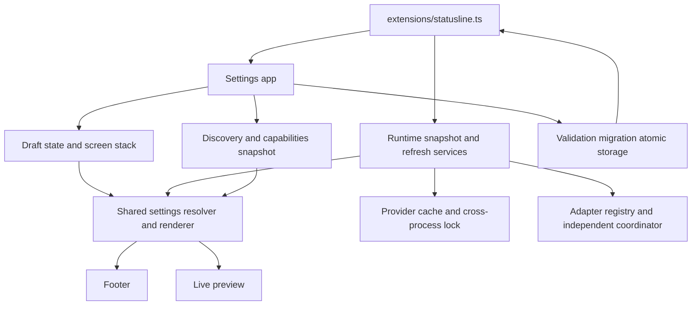

# New Pi Statusline Settings UI - Plan

## Goal Capsule

- **Objective:** Replace the bare `/statusline` provider-only list with a complete keyboard-driven Pi terminal settings application that controls the complete existing statusline without losing its data sources, cache behavior, or terminal correctness.
- **Authority:** The user request in this session is the product contract. Existing runtime behavior is an authoritative non-regression source where the request says to preserve it.
- **Execution profile:** Deep, cross-cutting TypeScript refactor with a new versioned user configuration, modular TUI, renderer integration, provider services, migration, and full test coverage.
- **Resolved scope decision:** Bare `/statusline` is UI-only. The old `on`, `off`, and `toggle` argument shortcuts are removed rather than retained as compatibility aliases.

---

## Product Contract

### Summary

The statusline gains a theme-native in-terminal configuration application with exactly three root sections: Providers, Separators, and Emojis. It edits an isolated draft, previews through the production renderer, and applies a fully validated configuration only after an atomic save.

The refactor must replace the old configuration hierarchy and provider-only `SettingsList` menu, but not the statusline’s useful behavior: project/Git data, model and thinking state, context, dynamic quota windows, provider rows, local and hosted speed, token/cost ledger, time, pending state, provider cache, and cross-process refresh coordination all remain available and configurable.

### Actors

- A1. **Pi user:** Opens `/statusline`, changes settings using only a keyboard, previews the result, and saves/discards/resets safely.
- A2. **Pi runtime:** Supplies current model, model registry, context, session usage, footer, theme, event stream, and queued-message state.
- A3. **Provider service:** Supplies only authorized, adapter-supported quota data; can be slow, stale, unavailable, or best-effort.
- A4. **Future provider extension:** Registers models/providers unknown to the extension implementation and must work through discovery/capability rules without UI changes.

### Requirements

**Settings application and navigation**

- R1. A bare `/statusline` opens a complete Pi-terminal settings application with exactly the root entries `Providers`, `Separators`, and `Emojis`; it uses the active theme, needs no browser/editor, is keyboard-controlled, highlights the current row, and keeps text understandable without color.
- R2. The application supports the stated navigation contract: Up/Down navigation, Left/Right simple-value changes, Enter submenus/text edit/confirm, Space toggles, Ctrl+Up/Down reordering, Tab preview focus, S save, R selected reset, Shift+R section reset, D full reset, Esc back/cancel, Q close, and context-sensitive `?` help. Narrow screens collapse preview/help before navigation or selected values.
- R3. Every screen shows a live preview when space permits. Preview rendering uses the same production rendering/formatting path and prioritizes current runtime data, then fresh cache, then clearly identifiable representative fixtures. Modes are `Current session`, `Local model`, `Subscription provider`, `API provider`, and `Narrow terminal`; fixture preview is visibly labelled. It never starts network, Git, session scans, or refresh work on render.
- R4. Opening settings deep-clones runtime configuration. Draft mutations never alter runtime settings, footer output, cache policy, or refresh timers before save. Close with changes presents Save, Discard, Cancel; save success notifies; save failure leaves persisted/runtime values intact and retains the draft.
- R5. Reset selected value, provider, section, and all settings operate on the draft only; provider/section/all resets require confirmation and become durable only after save.
- R6. The statusline command is UI-only: remove legacy `on`, `off`, and `toggle` command arguments, completions, and legacy menu semantics. In TUI mode, non-empty arguments receive a deterministic no-arguments notice; in RPC/JSON/print modes, the command reports that settings require the interactive terminal UI instead of silently doing nothing. Global enable/disable belongs in the settings application.

**Versioned configuration and persistence**

- R7. Replace the legacy configuration model with a versioned `StatuslineSettings` shape containing `version`, `enabled`, `providers`, `layout`, `separators`, `segments`, `bars`, `thresholds`, `timing`, `icons`, and `preview`. Provider configuration is `Record<string, ProviderConfiguration>` and dynamic windows use stable string keys, never fixed provider unions or window positions.
- R8. The schema supplies global defaults plus sparse per-provider and active-model overrides; display-mode `default` resolves capability-appropriate defaults and `custom` snapshots the resolved values before individual edits. Three-state active-model values (`default`, `on`, `off`) inherit global segment settings.
- R9. Parsing validates, normalizes, bounds, and safely falls back to new defaults for invalid documents. It preserves recognized unknown provider records and practical unknown/future fields during unrelated reads/edits/saves, rejects unsafe control/ANSI/newline/bidi input and unsafe external display strings, supports future migrations, and migrates useful legacy settings once without retaining the old hierarchy as runtime architecture. A document from an unsupported future schema version opens read-only and is never overwritten; legacy migration becomes durable only on an explicit successful save.
- R10. Saving validates/normalizes first, writes a uniquely named sibling temporary file, atomically renames it, cleans temporary failures, and only then replaces runtime settings, reconfigures services, and requests a footer render. The post-rename runtime application is designed total/idempotent and cannot invalidate the committed configuration; service failures degrade individual health rather than throw. Existing configuration remains intact on failed write or rename.

**Dynamic providers, capabilities, and quota sources**

- R11. Provider discovery deduplicates `ctx.modelRegistry.getAvailable()` by `model.provider`, then reconciles extension-registered providers when available, active provider, and stored providers. It feature-detects optional registry methods such as `getRegisteredProviderIds`, `getProviderDisplayName`, `getProviderAuthStatus`, and `getProvider`; it must not require methods absent from Pi 0.80.7.
- R12. New discovered providers get default configuration; stable saved order, disabled state, window settings, unavailable providers, and unknown stored providers survive refresh/reopen. Do not list unconfigured built-in catalog providers merely because Pi knows them.
- R13. A centralized capability resolver derives availability, authentication, model count, local/hosted/subscription/API-billed presence, quota reliability, local input/output and hosted streaming speed, token ledger, cost ledger, and sanitized unavailable reason from models, auth, endpoint data, adapters, and current active model. UI components must not branch on provider names.
- R14. A provider adapter registry, not UI code, owns supported provider-wide quota refresh. Anthropic OAuth and OpenAI Codex are official; Z.AI is visible as best-effort; unsupported providers state a sanitized reason and never invent quota, reuse another provider’s data, expose credentials/raw errors, or query undocumented arbitrary endpoints.
- R15. Providers screen lists the global statusline enabled row and separate provider-tracking enabled row, then dynamic provider rows with enabled status, display name, availability/authentication, applicable type, quota reliability, and recent data health. Space disables provider-wide rows/refresh while retaining its configuration and generic active-model segments; Ctrl+Up/Down changes persisted row order.
- R16. Provider detail screens display only capability-supported controls. Subscription providers configure quota windows, bar/percentage/reset/display/missing-data/refresh policy; local providers configure local throughput; hosted/API providers configure streaming speed and actual token/cost ledger. Unsupported quota controls state `Not available` with a sanitized reason rather than presenting deceptive toggles.
- R17. Returned quota windows drive window discovery. Every adapter emits a non-empty stable `key` separate from mutable display `label`; invalid/duplicate keys fail closed, and unknown keys receive defaults while preserving known custom settings across reordered/renamed windows. Window controls cover visibility, label, bar, percent, reset countdown/exact time/date, used/remaining amounts, zero display, and width.
- R18. Provider refresh remains independent, bounded, cache-backed, and outside footer/UI render. Each supported provider exposes validated refresh interval, maximum cache age, use-cache, keep-after-failure, refresh-while-active, refresh-disabled-provider, and explicit refresh-now controls; disabled quota providers do not start refresh timers unless an explicit supported setting permits it. Slow/failing providers do not block others; fresh cache survives temporary refresh failure and becomes unavailable only after maximum age; locks continue preventing duplicate cross-process fetches.

**Footer configuration and rendering**

- R19. All existing visible features have global and applicable provider/active-model controls: project/directory/icon; Git branch, Nerd Font branch icon, ahead/behind counts, existing tested dirty/clean/error indicators, and refresh interval; model ID/provider/model icon/session-cost append and precision; thinking state/icon/applicability; context percentage/window/current tokens/percent and token thresholds; active quota/loading (through missing-data policy)/bars/percent/reset/dynamic windows; local input/output and hosted streaming speed; API input/output/cache token ledger and known session cost; active/elapsed/last-turn time/icon/format; and pending label/icon/hide-when-empty.
- R20. Default segment order is `project`, `model`, `effort`, `context`, `session`, `throughput`, `time`. Users configure order and narrow-priority independently, including enabled, compact priority, droppable, preserve, and truncatable policy. Under width pressure, recomposition uses ANSI-aware Unicode display width, never splits escapes or wide emoji, and safely truncates provider rows.
- R21. Separators screen controls sections, segment ordering/narrow policy, main/project-Git/window/provider/icon-label/label-value separators, percentage/reset spacing, separator before/after/trailing spacing, custom padding, presets (`Default`, `Compact`, `Minimal`, `Pipes`, `Arrows`, `Unicode`, `ASCII`, `Custom`), custom Unicode/ASCII input, provider row layout (new line, one line, automatic wrapping, placement, maximum width), bars, context thresholds, and time settings. Default remains main line followed by one provider per line.
- R22. Usage-bar settings preserve the continuous rounded track by default and configure visibility, width, fill/empty/caps, percent/spacing, truecolor/theme fallback, warning/critical transitions, and zero/full appearance. Bar values clamp 0–100, survive narrow sizes, and remain width-correct.
- R23. Local endpoint detection continues to include localhost, loopback, private network, and `.local`. Local input speed is never shown for hosted inference; local input/output settings cover estimated missing usage, rolling idle average, live stream rate, zero-before-measurement, unit/icon/direction, severity thresholds, baseline coloring, and safely bounded history.
- R24. Hosted streaming speed is a separate applicable output-only pulse while streaming. API ledger uses only Pi assistant-message token/cost data, supports input/output/cache-read/cache-write selection, compact numbers, known/nonzero cost rules and precision, idle visibility, and replacement by streaming speed; it never estimates unknown financial cost.
- R25. Context and quota thresholds are separate. Defaults are 80% warning and 95% critical; provider quota overrides are supported. State labels/indicators distinguish normal, warning, critical, exhausted, partial/inherited/best-effort, and unavailable even without color.
- R26. Emojis screen controls global icon visibility/style (`Emoji`, `Unicode`, `ASCII`, `Nerd Font`, `Minimal`, `No icons`, `Custom`) plus default/custom/hidden values for every named project/model/thinking/context/throughput/ledger/reset/time/pending/Git/health symbol. Provider icons are dynamic `Record<string, ...>` values with use-default, use-global-provider-icon, custom, and hidden modes; both provider detail and `Emojis > Provider icons` edit the same draft setting.
- R27. Missing provider data follows configurable policy: hide, cached value, N/A, warning, or provider name only. Reasons stay sanitized (for example authentication required, timeout, stale, unsupported adapter, management key required, best-effort endpoint changed).

**Compatibility, performance, and documentation**

- R28. Preserve real existing statusline behavior and defaults where sensible: Git adds no signals beyond the current ahead/behind/dirty/clean/error contract; non-reasoning effort and unavailable context self-hide; quota deduplication avoids showing an active provider both in session and provider row; state/data-only changes request render without re-fetching during render.
- R29. The implementation works in narrow/wide terminals, SSH/tmux, light/dark/no-truecolor, no emoji/Nerd Font, ASCII-only, wide Unicode, and combining-character practical cases. It uses `visibleWidth`/ANSI-aware truncation rather than string length, scrolls long provider lists, and does not crash on unsupported glyphs.
- R30. README documents the three-section UI, controls, saved settings/migration behavior, dynamic provider discovery/capabilities, defaults, provider limitations/reliability, cache/refresh behavior, data privacy, and compatibility change that arguments are no longer commands.

### Key Flows

- F1. **Open and preview:** User runs bare `/statusline`; discovery/capability snapshot is prepared once, a cloned draft opens at the three-item root, and all edits re-render the preview through the production renderer without changing runtime settings.
- F2. **Save or discard:** User saves; normalized draft atomically replaces the file, then runtime renderer and refresh coordinator receive the new settings. Discard/cancel or save failure keeps the old runtime/file.
- F3. **Provider lifecycle:** Session start, active-provider model selection, or reopening settings reconciles discovered, active, stored, custom, unavailable, and newly authenticated providers while preserving user selection/order/overrides.
- F4. **Quota lifecycle:** Each enabled supported adapter refreshes independently under cache/lock policy. Fresh data produces dynamic configured rows/windows; transient failures retain fresh cache until stale; unsupported/missing data follows policy and sanitized health.
- F5. **Model lifecycle:** Selecting a local, hosted subscription, API, mixed, or unknown provider resolves active-model applicability at render time and shows only supported configured fields.

### Acceptance Examples

- AE1. Root always contains only Providers, Separators, Emojis; a selected row is visually distinct, disabled/partial/unavailable states retain textual meaning, and a full-width preview uses the current theme.
- AE2. A provider list with Anthropic, Codex, Z.AI, Ollama, OpenRouter, a custom provider, active-only provider, and stored-but-unavailable provider has stable saved ordering; only configured/active/stored sources appear; no catalog-only provider appears.
- AE3. A local active model renders configurable local `↑`/`↓` rates; a streaming hosted model renders configurable `↓` only; idle API model renders configured actual token/cost ledger; subscription quota appears only through an adapter-supported current window set.
- AE4. A provider without an adapter presents `Provider quota: Not available` and a sanitized reason. No test fixture can reveal its token, raw response, authorization header, or key.
- AE5. Switching a provider from default to custom leaves the preview unchanged until a selected supported setting changes. An unknown provider and new `monthly` window retain/reconcile configuration without array-index corruption.
- AE6. Toggling a provider in a draft, reordering it, editing an icon/separator, and then Escape leaves the runtime/footer/file byte-for-byte at its pre-open semantic configuration. Save changes only after atomic write success.
- AE7. At narrow width, whole low-priority segments drop before truncation, separators recompute without gaps, ANSI styles remain valid, a wide emoji is not split, and provider rows truncate safely.

### Scope Boundaries

- No browser, external editor, mouse requirement, credentials in settings, raw provider diagnostics, quota fabrication, arbitrary endpoint probing, or provider-name-only UI conditionals.
- No new Git signal beyond the current ahead/behind/dirty/clean/error contract unless separately designed and tested.
- No runtime dual renderer or permanent legacy settings hierarchy. Migration is one-way into the new schema; representative old default output is tested where behavior should remain stable.
- No incident panel, support-bundle command, explicit rollback command, or compare-and-swap/generation protocol beyond the requested atomic-save semantics. Add only if an operational need appears.

---

## Planning Contract

### Key Technical Decisions

- **KTD1 — New settings modules own configuration, not the extension entry.** Create `src/settings/` schema/default/validation/migration/storage/state/provider/UI/preview modules. `extensions/statusline.ts` becomes composition root for command, events, footer installation, runtime services, and opening the app.
- **KTD2 — Preserve unknown fields semantically, not byte formatting.** Keep an opaque unknown-field bag as documents are parsed and merged so unrelated saves preserve future/provider data where practical. Validation/normalization may reformat JSON; use the smallest durable approach rather than a raw-document/CAS layer.
- **KTD3 — One snapshot-driven production renderer powers footer and preview.** Extract pure render inputs from current state and resolve settings/capabilities before formatting. A snapshot module hydrates persisted branch totals once outside render on session start/reload/tree replacement, incrementally updates assistant usage/events, and invalidates on relevant branch changes; preview uses a captured runtime/cache/fixture snapshot and the draft. No separate mock renderer.
- **KTD4 — Capability-first provider design.** Discovery returns provider descriptors; adapter registry and its adjacent sanitized-reason registry declare known provider protocol, quota support, and reliability; resolver inspects models/auth/endpoints/current model. Only those service registries may use provider IDs; UI never does.
- **KTD5 — Retain existing cache and independent refresh foundations behind settings-driven policy.** Evolve `ProviderUsageCache` and `ProviderRefreshCoordinator` interfaces for per-provider interval/max-age/cache/failure/disabled policy rather than moving network behavior into UI or renderer.
- **KTD6 — Build the TUI as one stateful `ctx.ui.custom` component with focused screen models and small components.** A settings app owns stack, selection, edit/confirmation focus, draft, and preview. It uses Pi TUI primitives including `parseKey`/`matchesKey` for Ctrl+Up/Down where they fit, owns key routing so required editing is testable, and offers an accessible reorder fallback when terminals/tmux cannot deliver Ctrl arrows.
- **KTD7 — Represent applicability and degradation independently.** Capability says whether a value can exist; runtime health says whether current data is fresh/cached/stale/unavailable. Rendering can self-hide only the affected feature while settings remains editable and reports a sanitized reason.
- **KTD8 — Preserve the current functional baseline through fixture-level rendering tests, not a legacy runtime.** Codify representative existing local/subscription/API/Git/time/pending/cache behavior as assertions while replacing the old pipeline; list intentional default presentation changes only where this request requires them.
- **KTD9 — Remove command arguments deliberately.** The registered command accepts no settings verbs or completions. The global enable setting lives in the Providers screen header, preserving the exact three-entry root while satisfying the user’s UI-only decision without leaving a shadow command model.

### High-Level Technical Design

### New Settings Shape and Defaults

`StatuslineSettings` is versioned at the root and is the sole runtime configuration. `providers` contains `enabled`, `order`, default provider presentation/refresh/missing-data policy, and `Record<string, ProviderConfiguration>`. A provider configuration contains enabled/display mode, supported display overrides, `windows: Record<string, WindowConfiguration>`, active-model overrides, optional thresholds, and provider icon mode/value. `layout` contains provider placement/wrapping/max width and segment order/narrow priority. `separators`, `segments`, `bars`, `thresholds`, `timing`, `icons`, and `preview` hold the controls named in R19–R26.

Defaults reproduce current behavior where it remains meaningful: footer enabled; project/model/effort/context/session/throughput/time order; current compact preservation/drop behavior (`time`, `throughput`, `project`, `effort`, `model`, `session`, retaining `context` last); project Git HUD on; Nerd Font and optional cost/elapsed/last-turn/pending off; rounded width-12 usage bars; new-line provider rows; warning/critical defaults 80/95; 10-second refresh minimum/default and five-minute cache maximum; existing local endpoint detection, rolling five-sample behavior, streaming definition, and supported adapter set. Default icon style is Emoji but ASCII/no-icon styles provide an explicit compatibility route.

### Migration and Persistence Rules

Read the existing `~/.pi/agent/statusline.json` unversioned document through a one-time migration that maps footer enable, segment toggles, extras, and provider-tracking selection/order/usage-percent-reset overrides into the new groups. It never copies secrets, does not create a fake provider adapter, and preserves unknown legacy provider keys as disabled/stored records when their meaning cannot be mapped. Invalid JSON, invalid types, impossible threshold/order/width/interval values, and unsupported enum values fall back safely while retaining only safe opaque unknown data. Refresh intervals below 10 seconds normalize to 10 seconds; maximum cache age is finite and at least the interval. A valid unsupported future version is not normalized or saved: it remains read-only until a compatible extension opens it.

### Provider and Renderer Rules

Provider discovery runs on session start, model selection when the active provider changes, and settings open, not footer render; Pi 0.80.7 has no registry-change subscription, so no unsupported automatic registry-change promise is made. Its snapshot contains each provider’s models, optional display/auth metadata, provenance, capabilities, health, and stable reconciliation result. Refresh eligibility requires global/provider tracking, provider enabled, adapter support, and policy permission. The active model still gets generic project/model/context/etc. output even if its provider row is disabled.

Render resolution uses global values, provider display mode, current model capabilities, and active-model tri-state overrides. It formats only available, applicable data. Provider rows use saved order, dynamic windows, missing-data policy, and active-provider deduplication. Shared width helpers are used for all footer and preview lines; provider rows use the same truncation policy.

### Test Direction and Sequencing

Start with pure schema/discovery/capability/resolution/render tests and fixture snapshots, then wire runtime refresh policy, then settings UI. UI tests use a deterministic fake Pi context/TUI and immutable runtime snapshot whose I/O ports throw: navigation/render must not trigger fetch, Git, filesystem persistence, cache lock, registry scans, or session-branch scans. Production runtime retains event-driven snapshots.

Sequence: U1 → U2 → U3 → U4 → U5 → U6 → U7 → U8 → U9 → U10/U11/U12 → U13. U7 and U8 are serialized because they share UI-test ownership; U12 is the first unit that requires the fully integrated command handler.

---

## Implementation Units

| Unit | Title | Key paths | Depends on |
|---|---|---|---|
| U1 | Versioned settings core and migration | `src/settings/{schema,defaults,validation,migrations,storage,state}.ts`, `test/settings-*.test.ts` | — |
| U2 | Provider discovery, capability, and adapters | `src/settings/providers/{discovery,capabilities,adapters}.ts`, `test/settings-providers.test.ts` | U1 |
| U3 | Settings-driven renderer and resolution | `src/settings/{resolve,preview}.ts`, `src/{bar,segments,format,derive,throughput}.ts`, `test/settings-render.test.ts` | U1, U2 |
| U4 | Settings-aware refresh/cache runtime | `src/{providers,provider-cache,ratelimit}.ts`, `test/settings-refresh.test.ts` | U1, U2 |
| U5 | Extension composition-root refactor | `extensions/statusline.ts`, `test/statusline.test.ts` | U1–U4 |
| U6 | Settings application shell and dialogs | `src/settings/ui/{settings-app,components,dialogs,main-screen}.ts`, `test/settings-ui.test.ts` | U1–U3 |
| U7 | Dynamic provider screens | `src/settings/ui/{providers-screen,provider-screen,provider-window-screen}.ts`, `test/settings-ui.test.ts` | U2, U4, U6 |
| U8 | Separators and emojis screens | `src/settings/ui/{separators-screen,emojis-screen}.ts`, `test/settings-ui.test.ts` | U1, U3, U6, U7 |
| U9 | End-to-end command/lifecycle integration | `extensions/statusline.ts`, `test/statusline.test.ts` | U5–U8 |
| U10 | Systematic service/config regression coverage | `test/{settings-core,settings-providers,settings-refresh}.test.ts` | U1–U4 |
| U11 | Renderer/width/preview parity coverage | `test/{settings-render,segments,bar,throughput,statusline}.test.ts` | U3, U5 |
| U12 | Real command/TUI interaction coverage | `test/{settings-ui,statusline}.test.ts` | U6–U9 |
| U13 | Documentation and release-facing examples | `README.md` | U9–U12 |

### U1. Versioned settings core and migration

- **Goal:** Establish the new schema, defaults, opaque preservation, validation, migration, atomic storage, and isolated draft state without retaining `src/config.ts` as the architecture.
- **Requirements:** R4, R5, R7–R10, R25–R26.
- **Files:** Add `src/settings/schema.ts`, `defaults.ts`, `validation.ts`, `migrations.ts`, `storage.ts`, `state.ts` and focused settings tests. Keep `src/config.ts` and its tests as a temporary compatibility facade until U5 migrates its consumers, then remove legacy runtime ownership in U5.
- **Approach:** Define settings/value enums and stable dynamic records, one safe parser/normalizer, a migration from the current unversioned same-path document, structured-clone draft/reset operations, input/display sanitization, and unique-sibling-temp/rename storage injected for failure tests. Preserve unknown safe fields semantically through the typed document boundary; unsupported future versions are read-only and legacy migration persists only on explicit save.
- **Test scenarios:** Defaults; valid parse; invalid JSON/types/ranges/enums; hostile pasted control/ANSI/bidi/newline input and hostile provider labels; unknown top-level/provider/window fields; unknown/missing provider preservation; migration mapping and explicit-save durability; future-version read-only preservation; new provider reconciliation; no runtime/draft aliasing; selected/provider/section/all reset only changes draft; successful atomic save; concurrent temporary names/cleanup; write/rename failure leaves original/runtime untouched.
- **Verification:** `npm test` includes focused settings cases and `npm run typecheck` passes.

### U2. Provider discovery, capabilities, and adapter registry

- **Goal:** Make every provider-facing decision dynamic and truthful.
- **Requirements:** R11–R17, R27–R28.
- **Files:** Add provider service modules and tests; migrate known refresh functions from `extensions/statusline.ts` into adapter implementations; retain parsers in `src/ratelimit.ts` or a provider parser submodule.
- **Approach:** Build descriptors from available models, optional methods guarded by `typeof`, registered/custom providers when exposed, active provider, and stored config. Reconcile stable order. Compute capability from models/auth/endpoints/adapter metadata; register known quota adapters outside UI; return only sanitized health/reasons.
- **Test scenarios:** Deduped multiple models; custom/extension provider; active missing from available; stored temporarily missing/newly authenticated/disappearing provider; registry missing each optional method; local/API/subscription/mixed/unknown capabilities; official/best-effort/unsupported adapter; unauthenticated and unknown cost; adapter keys stable across reordered/renamed labels and duplicate/invalid keys fail closed; dynamic unknown windows.
- **Verification:** Service tests demonstrate no hardcoded provider union/no secret propagation, and a repository test derives the known adapter/reason-registry provider IDs (including `anthropic`, `openai-codex`, `zai`, and `openrouter`) then fails if any literal appears in `src/settings/ui/**`.

### U3. Settings-driven renderer, layout, and preview

- **Goal:** Refactor production footer rendering into reusable settings resolution and formatting so preview and footer cannot drift.
- **Requirements:** R3, R8, R17, R19–R29.
- **Files:** Add `src/settings/resolve.ts` and `preview.ts`; adapt `src/bar.ts`, `segments.ts`, `format.ts`, `derive.ts`, and `throughput.ts`; add rendering tests.
- **Approach:** Introduce a cached runtime snapshot module and pure render function. Hydrate session branch totals outside render at start/reload/tree replacement, then incrementally update or invalidate them from relevant events. Resolve global/provider/active-model/window settings and availability before calling existing derivations/formatters. Parameterize existing separators, icons, layout, bar style, threshold, time, ledger, and throughput behavior while preserving actual Pi usage/cost and local detection semantics.
- **Test scenarios:** Local throughput controls including zero/estimate/live-vs-idle/baseline/history; hosted stream speed controls; API ledger input/output/cache/cost/precision/replace-on-stream rules; subscription dynamic quotas; order/overrides/default-to-custom continuity; separators/icons/no icons/ASCII; bars 0/full/clamped/narrow; context/quota thresholds; pending/time/Git including existing dirty state toggles; deduplication; loading via missing-data policy; all missing-data policies; ANSI/wide Unicode widths; current/cache/labelled local/subscription/API/narrow preview modes; preview output equals production renderer for identical snapshot/settings; branch-total hydration over resume/reload/tree replacement.
- **Verification:** Every state uses `visibleWidth`/ANSI-safe truncation and no renderer invokes I/O.

### U4. Settings-aware refresh, cache, and health

- **Goal:** Preserve independent provider quota operations while allowing validated refresh/cache/missing-data settings to control them.
- **Requirements:** R14, R16, R18, R27–R28.
- **Files:** Adapt `src/providers.ts`, `provider-cache.ts`, and adapter/parser integrations; add refresh tests.
- **Approach:** Pass resolved refresh eligibility/policy to coordinator; retain one in-flight refresh per provider and cross-process cache lock/atomic writes. Keep existing fresh usage across transient failure until max age and expose sanitized health to renderer/UI. Reconfigure schedules only after a successful settings save.
- **Test scenarios:** Disabled provider makes no adapter/network call; unsupported provider makes no network call; fast succeeds while slow times out; interval/max-age boundaries; cached survival then expiry; lock suppresses duplicate refresh; settings changes reconfigure after save only; sanitized timeout/auth/management/best-effort reasons contain no credential fragments.
- **Verification:** Coordinator/cache tests preserve independent execution and locking.

### U5. Extension composition-root refactor

- **Goal:** Leave `extensions/statusline.ts` responsible only for Pi registration, event/snapshot lifetime, footer installation, runtime service composition, and opening the settings app.
- **Requirements:** R4, R6, R18, R28.
- **Files:** `extensions/statusline.ts`, `test/statusline.test.ts`.
- **Approach:** Replace inline config/fetch/render decision logic with imports from U1–U4. Keep a temporary deterministic unavailable-settings notice facade until U6–U8 provide the app; migrate all `src/config.ts` consumers and remove the old config/menu code here. Keep Pi event handling for meter/context/Git/session/response/model changes, seed/update a cached snapshot, and request repaint. U9 makes the final bare UI-only registration.
- **Test scenarios:** Session lifetime cleanup; restore/remove footer through settings enabled state; event-driven updates; snapshot hydration/invalidation across session resume/reload/tree replacement; no stale session mutation; migrated config facade removal compiles. Final UI-only command and draft-isolation assertions belong to U9/U12.
- **Verification:** Existing statusline behavior tests are migrated rather than deleted, then extended for settings integration.

### U6. Settings application shell, navigation, edit, dialogs, and preview

- **Goal:** Implement one responsive draft-owning terminal application with the exact root menu and safe save/discard/reset behavior.
- **Requirements:** R1–R5, R29.
- **Files:** Add UI shell/component/dialog/main-screen modules and `test/settings-ui.test.ts`.
- **Approach:** Use `ctx.ui.custom` and Pi TUI components where useful; own a screen stack, selected rows, focus, scrolling, edit buffer, draft state, confirmation state, contextual help, and preview pane. Build reusable row/status/width helpers using theme roles and textual indicators.
- **Test scenarios:** Root has exactly three sections; keyboard navigation including Left/Right and accessible Ctrl-arrow reorder fallback; selected/highlighted text; state indicators independent of color; current/local/subscription/API/narrow preview modes and fixture label; Tab/narrow preview behavior; text entry/clear/cancel/paste input routing; help adaptation; dirty close dialog; save failure; success confirmation; selected/provider/section/all reset confirmations; I/O-trap navigation/render stays pure.
- **Verification:** Fake TUI drives component input and asserts preview changes while captured runtime settings do not.

### U7. Dynamic provider, detail, window, active-model, and refresh screens

- **Goal:** Deliver truthful provider configuration from the shared draft and capability snapshot.
- **Requirements:** R11–R18, R24–R27.
- **Files:** Add provider UI screens and expand `test/settings-ui.test.ts`.
- **Approach:** Providers screen reuses discovery order/health and supports Space/Ctrl ordering. Detail screen derives rows from capabilities and display mode. Window, active-model, and refresh/cache submenus bind to the same draft paths. Provider icon editing binds to global icon provider record.
- **Test scenarios:** Global footer versus provider-tracking toggles; dynamic list/custom/unavailable provider; toggle and reorder; local vs subscription vs API vs unknown rows; locked default/custom copy; dynamic windows and stable keys; default/on/off active-model inheritance; refresh-now action; all missing-data policies; threshold/refresh validation; no refresh starts while navigating. Component tests run directly before U9; U12 tests the integrated command.
- **Verification:** Screen tests drive provider screens directly with fake context/draft and assert the saved dynamic record; command-handler integration is proven in U9/U12.

### U8. Separators, sections/order, bars, thresholds/timing, and emojis screens

- **Goal:** Expose every remaining visible footer feature under the required Separators and Emojis roots.
- **Requirements:** R19–R26.
- **Files:** Add `separators-screen.ts`, `emojis-screen.ts`, component support, and UI/render tests.
- **Approach:** Present nested rows for global sections, segment order/narrow policy, separator presets/custom strings/layout, bar parameters, context/time values, icon styles/values, and provider icon list. Reuse draft update helpers and production preview.
- **Test scenarios:** Every listed feature has a reachable setting; project/Git/model/thinking/context/session/throughput/time/pending controls; Ctrl reorders segment/narrow priority; every separator/padding/spacing field; custom separator/icon edit with sanitization; presets; provider layout variants; every bar field; context/time/threshold controls; no icons/ASCII/Nerd Font; every provider-icon mode changes match provider detail; reset section restores defaults only in draft.
- **Verification:** Reachability matrix maps R19–R26 controls to screen test cases.

### U9. End-to-end command and runtime integration

- **Goal:** Connect saved settings to renderer, reconfiguration, and session lifetime without reintroducing UI/service coupling.
- **Requirements:** R1, R4, R6, R18, R28–R29.
- **Files:** `extensions/statusline.ts`, existing and new integration tests.
- **Approach:** On save, replace settings atomically in memory, reconcile discovered providers, reconfigure refresh/Git/ticks once through idempotent non-throwing runtime application, and request rendering. Reopen discovery on each command. Keep UI preview snapshot isolated from concurrently updating runtime services. Make final command behavior deterministic: bare opens only in TUI, non-empty TUI arguments notify no-arguments, and RPC/JSON/print notify interactive-TUI-required.
- **Test scenarios:** `/statusline` opens root; preview save applies; discard does not; storage failure does not; post-save service degradation leaves the committed configuration valid; re-open discovers new provider; provider disable skips refresh; session shutdown disposes all timers; active quota dedupe persists with provider settings; non-empty and non-TUI command behavior.
- **Verification:** Integration suite runs with stubbed registry/cache/adapters and no unresolved handles.

### U10. Configuration/provider/refresh regression matrix

- **Goal:** Ensure migration and operational correctness do not depend solely on UI tests.
- **Requirements:** R7–R18, R27–R28.
- **Files:** New focused test files referenced by U1, U2, U4.
- **Approach:** Turn every configuration, provider discovery/capability, and provider refresh test bullet in the request into a named pure/service test. Preserve existing cache/coordinator tests as the cross-process baseline.
- **Test scenarios:** The complete user-listed configuration, provider discovery, capability, draft, and provider refresh matrices, including failure/secret cases.
- **Verification:** Tests fail if an unsupported provider fetches, an unknown provider disappears, a deep draft aliases runtime, or a raw error becomes visible.

### U11. Rendering, compatibility, and preview-parity regression matrix

- **Goal:** Prove every existing and newly configurable presentation remains correct across data modes and terminal widths.
- **Requirements:** R3, R19–R29.
- **Files:** New rendering tests plus `test/{bar,segments,throughput,statusline}.test.ts`.
- **Approach:** Use deterministic snapshots with semantic theme wrappers and Unicode width fixtures. Keep current runtime fixture assertions for local/subscription/API/Git/time/pending as capability-loss guardrails, documenting intentional UI-only/default changes.
- **Test scenarios:** The complete user-listed rendering matrix: local/hosted/API/subscription, dynamic windows/order/overrides, custom separators/icons/no icons/ASCII, narrow/Unicode, quota dedupe, missing/loading policy, zero hiding, and preview/renderer equivalence. This unit owns the representative current behavior fixtures rather than a legacy renderer.
- **Verification:** No snapshot invokes I/O and styled output remains width-bounded.

### U12. Command-driven UI interaction matrix

- **Goal:** Exercise the actual `/statusline` handler and user interactions, not only screen helpers.
- **Requirements:** R1–R6, R15–R17, R29.
- **Files:** `test/settings-ui.test.ts`, `test/statusline.test.ts`.
- **Approach:** Expand current `ctx.ui.custom` test doubles into a deterministic driver that opens, routes keys, renders widths, submits/cancels edits, and captures save/notification/runtime effects.
- **Test scenarios:** Every user-listed UI interaction: root open, each section, dynamic provider list, toggle/configure/edit/reorder, preview updates, save/discard/unsaved dialog/reset/escape, text-edit semantics, selected visibility and long-list scroll.
- **Verification:** Tests prove bare command UI-only behavior and absence of legacy provider-only menu.

### Control Reachability Matrix

| Settings domain | Implementation owner | Reachable UI path | Named proof |
|---|---|---|---|
| Root enabled, draft/save/discard/reset, preview mode | U1, U6, U9 | Providers header; all screens; Tab preview | U1/U6/U9/U12 tests |
| Provider records, ordering, display/active-model modes, missing policy, refresh-now/cache/thresholds | U1, U2, U4, U7 | Providers > provider > Active-model, Usage windows, Refresh and cache | U2/U4/U7/U10/U12 tests |
| Dynamic window key/label/bar/percent/reset/exact/amount/zero/width | U1, U2, U3, U7 | Providers > provider > Usage windows > window | U1/U2/U3/U7/U11 tests |
| Project/Git/model/thinking/context/session/throughput/time/pending | U3, U8 | Separators > Statusline sections and nested controls | U3/U8/U11 tests |
| Segment order/narrow policy/layout/separators/padding | U3, U8 | Separators > Segment order/Narrow priority/Layout | U3/U8/U11/U12 tests |
| Bar characters/caps/width/colour/percent and context/quota thresholds | U3, U8 | Separators > Usage-bar settings/Context thresholds | U3/U8/U11 tests |
| Global symbols/icon style and dynamic provider icon modes | U1, U3, U7, U8 | Emojis > symbols/provider icons; Providers > provider icon | U7/U8/U11/U12 tests |

### U13. Documentation

- **Goal:** Make the released settings UI and operational limits understandable without inspecting source.
- **Requirements:** R30.
- **Files:** `README.md`.
- **Approach:** Replace old Configure/provider-menu documentation with the three-section UI, controls, schema/migration location, dynamic provider behavior, display modes, supported adapter reliability, cache/refresh policy, privacy/sanitization, terminal icon fallbacks, and UI-only command behavior. Use renderer-consistent examples for local/subscription/API previews.
- **Test scenarios:** Documentation-only review against shipped defaults and acceptance examples.
- **Verification:** Manual read-through after UI tests; no obsolete argument/menu claims remain.

---

## Verification Contract

| Contract | Source | Must match | Must not regress | Proof / approver |
|---|---|---|---|---|
| AC1. Terminal settings UI | User requirements R1–R6 and examples | Exact three-root menu, keyboard-only draft/save/discard/reset flow, theme-native accessible indicators, live production preview | Old provider-only root and argument command interface do not remain | Command/TUI interaction tests; maintainer runs `pi -e .` and approves keyboard smoke |
| AC2. Settings durability | R7–R10 | Versioned dynamic records, safe migration/defaults, semantic unknown preservation, validated atomic save | Failed save never changes original/runtime; no legacy hierarchy controls runtime | Settings parser/migration/atomic-failure tests; maintainer approves migration policy |
| AC3. Dynamic provider truthfulness | R11–R18 | Registry-driven discovery, capability-first rows, adapter reliability, dynamic windows, saved reconciliation | No catalog spam, fake quota, raw secrets/errors, UI provider-name branching | Discovery/capability/adapter tests with optional API omissions and custom providers |
| AC4. Footer data parity | R19, R23–R28 and current runtime | All existing data features, including the existing tested dirty Git token, remain configurable and applicable data renders through shared resolver | Hosted input speed, unknown financial costs, or duplicate active quota never appear; no new Git signal is invented | Rendering fixtures, existing statusline regression cases, maintainer live model smoke |
| AC5. Terminal rendering | R20–R22, R29 | Configurable layout/separators/bars/icons; ANSI/Unicode width-safe narrow output | Escape sequences/wide glyphs are not split; navigation remains usable | `visibleWidth` fixtures, ANSI/Unicode tests, manual narrow/ASCII/no-truecolor `pi -e .` smoke |
| AC6. Refresh/cache operations | R18, R27–R28 | Independent bounded providers, lock/cache atomicity, stale/failure policy, saved-only reconfiguration | Footer/UI render performs I/O; disabled/unsupported providers refresh; secrets leak | Coordinator/cache/I/O-trap tests; review of adapter boundaries |
| AC7. Documentation | R30 | README describes actual UI/defaults/limits/privacy/migration | Old menu and old command arguments are not documented | README review against runtime/interaction tests |

| Command | Applies to | Gate |
|---|---|---|
| `npm test` | U1–U12 | All existing plus new unit/service/render/UI tests pass |
| `npm run typecheck` | U1–U12 | No TypeScript errors against installed Pi 0.80.7 types |
| `pi -e .` | U5–U13 | Maintainer keyboard smoke at narrow/wide widths, active theme, ASCII/no-icon style, and a real configured provider where available |

---

## Definition of Done

- The bare `/statusline` command opens only the new Providers, Separators, Emojis terminal application; old provider-only menu and argument shortcuts are absent.
- New saved configuration is versioned, validated, migrated from useful old values, atomically written, draft-isolated, and safe under invalid/failing input.
- Provider discovery/capabilities/adapters are dynamic, truthful, sanitized, future-tolerant, and do not hardcode UI behavior by provider ID.
- All listed existing statusline data capabilities are controlled by settings and render through a single footer/preview path.
- Refresh/cache/lock behavior remains independently scheduled, cross-process safe, and outside UI/footer rendering.
- Settings and footer honor narrow terminal/ANSI/Unicode/no-icon compatibility requirements.
- Configuration, discovery, capability, refresh, rendering, preview parity, and real command-driven UI matrices are covered by tests.
- `npm test` and `npm run typecheck` pass; README matches shipped behavior; no abandoned legacy runtime/menu/config code remains.

---

## Appendix

### Source Grounding

- `extensions/statusline.ts` currently combines Pi event wiring, footer render, Anthropic/Codex/Z.AI fetches, menu, and command parsing; it is the extraction target.
- `src/config.ts` currently has unversioned `footerEnabled`, segment/extras booleans, and provider tracking. Its temporary-file/rename save pattern is reusable, not its hierarchy.
- `src/providers.ts` and `src/provider-cache.ts` already provide independent refresh, sanitized reasons, max age, cache persistence, and `proper-lockfile` coordination.
- `src/derive.ts`, `throughput.ts`, `ratelimit.ts`, `bar.ts`, `segments.ts`, `format.ts`, and `git.ts` contain the actual statusline behavior to preserve/configure.
- Current Pi 0.80.7 types expose `getAvailable`, `getProviderAuthStatus`, `getProviderDisplayName`, `getApiKeyForProvider`, `isUsingOAuth`, `registerProvider`, `ctx.ui.custom`, footer/theme APIs, and `visibleWidth`/`truncateToWidth`; optional methods named in R11 require feature detection.

### Traceability Notes

The requested opening/navigation/draft/save/reset requirements map to U1/U5/U6/U12; schema/migration/storage to U1/U10; discovery/capabilities/adapters/windows to U2/U4/U7/U10; renderer/layout/feature controls/preview to U3/U8/U11; lifetime integration to U5/U9; docs to U13. The source’s acceptance examples map to AE1–AE7 and AC1–AC7. Explicitly rejected divergent additions are scope boundaries, not unresolved questions.

### wo:divergent-analysis

- **Inversion and adversary — `anthropic/claude-opus-5`:** Retained fixture-level capability-loss rendering tests, an I/O-trap UI harness, hostile future/invalid configuration corpus, and optional-API/unknown-provider doubles. Rejected byte-identical legacy dual runtime and CAS/raw-document complexity because they conflict with a new renderer/schema and exceed atomic-save requirements.
- **3am operator — `openai-codex/gpt-5.6-sol`:** Retained per-capability degradation states that preserve editing/rendering while exposing sanitized health. Rejected incident panel, support bundle, explicit rollback, and post-write rollback protocol as unrequested surface/complexity.
- **Remove the load-bearing assumption — `openrouter/z-ai/glm-5.2`:** Branch unavailable (`403` key-limit infrastructure failure); not retried.
